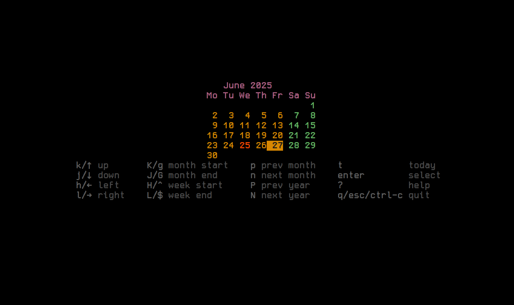
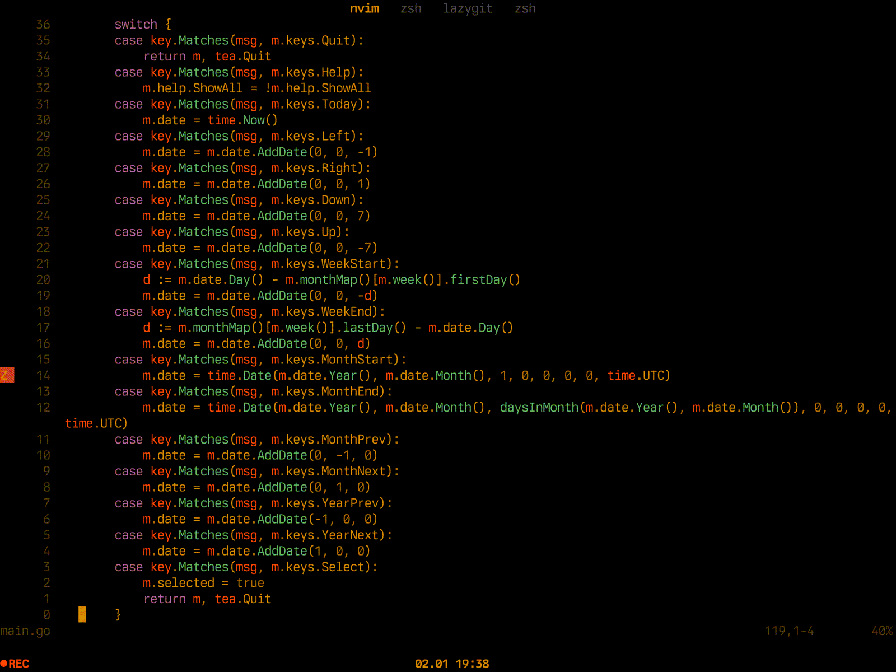

# TUI datepicker

fastly select date via vim-motions and print it to `stdout`

 

## Install

```bash
git clone git@github.com:maraloon/tui-datepicker.git
cd tui-datepicker
go install
```

## Usage idea

It's for what i develop this app. Terminal-based notes. Open (or create) file for selected date

```bash
#!/usr/bin/env sh
selected_date=$(tui-datepicker) || exit 1
nvim "$HOME/diary/$selected_date.md" # opens smth like ~/diary/2025/01/15.md
```

 

## TODO

- [x] Show today, style
- [x] Help menu
- [ ] Jumps
    - [x] Jump to today
    - [ ] Month jump
        - [x] p, n
        - [ ] m[1-12]<cr>
    - [ ] Year jump (yp, yn)
        - [x] P, N
        - [ ] y[1-12]<cr>
    - [ ] Jump in line: 3l - 3 days later
    - [ ] Jump n month up/down: 3ml/3m<down> - 3 month down 
    - [ ] Jump lines: 2j - 2 weeks later
- [ ] Lists
    - [ ] Month list (M)
    - [ ] Year list (Y)
- [ ] Views
    - [ ] Show 3 month view
    - [ ] Show full year view
- [ ] Toggle fullsceen (WithAltScreen)
- [x] Center align
- [ ] Toggle week start, monday or sunday
- [ ] Config file and cli opts
    - [ ] Week first day
    - [ ] Output date format 
    - [ ] Fullscreen

## Made with

<p><a href="https://stuff.charm.sh/bubbletea/bubbletea-4k.png"></a></p>
